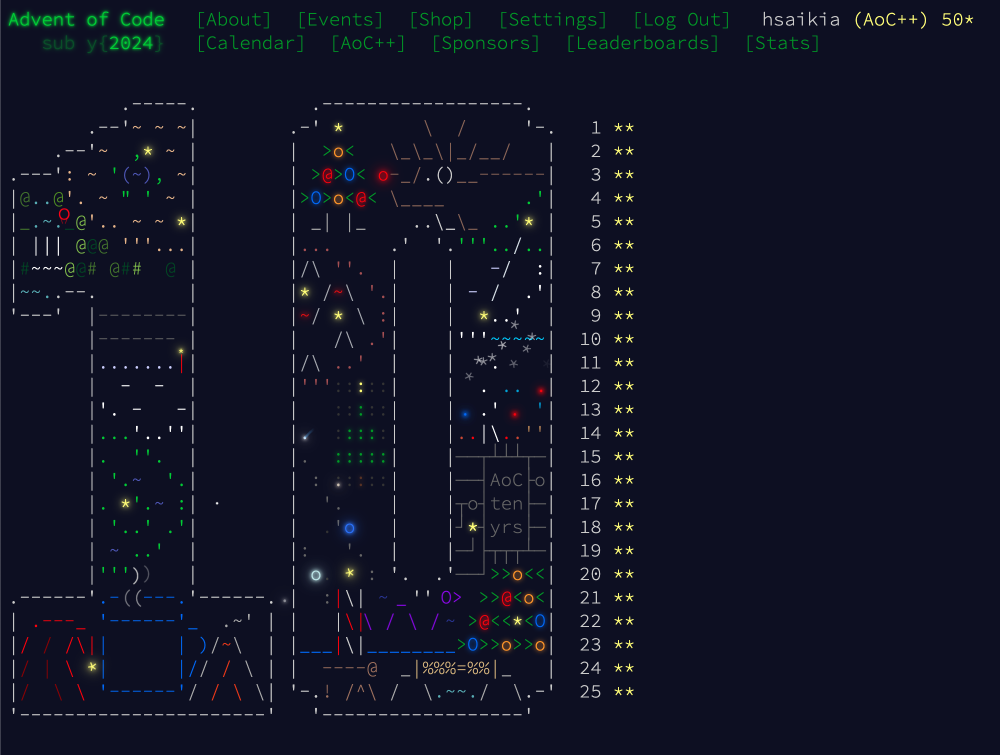
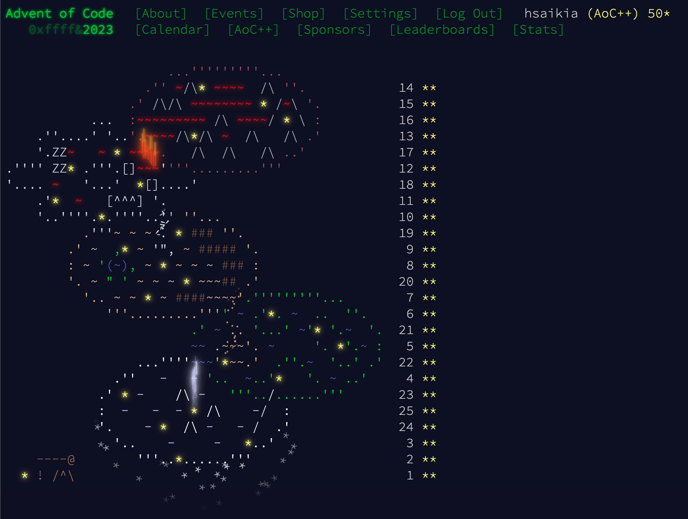

# Advent of Code

This repo contains my solutions to [Advent of Code](https://adventofcode.com/) problems in [Rust](https://www.rust-lang.org/). It also includes a helper library that I've developed over time, consisting of data structures and functions that have proven useful in solving past problems.




## How to run

You need to have rustc (and cargo) installed. Instructions [here](https://www.rust-lang.org/tools/install).

Then for any particular year_day we need to run this command from the root directory

```
cargo run --release --bin <year_day> <input_file>
```

For example for binary `2022_01` say we have a `sample_input.txt` file with the following contents 

```
1000
2000
3000

4000

5000
6000

7000
8000
9000

10000
```

Then we run 

```
cargo run --release --bin 2022_01 <full path to sample_input.txt>
```

which outputs the answers for both parts

```
Part #1 Answer 24000
Time elapsed in Part #1 is: 75µs

Part #2 Answer 41000
Time elapsed in Part #2 is: 5.042µs
```

## Testing

Unit tests are included for some problems using the sample IO. To run tests 

```
cargo test
```

To test a specific binary only

```
cargo test --bin 2023_01
```

## Documentation 

To generate the docs for this package, run `cargo doc --open`
